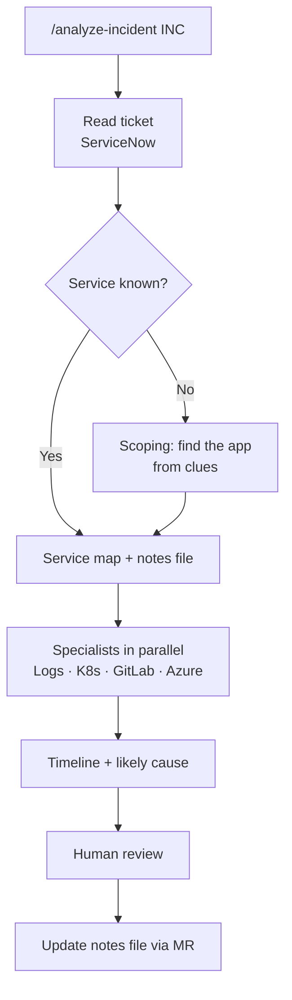

# 2. How it works (plain language)

## Step by step
1. **You report the case.** Run `/analyze-incident INC0012345` in Copilot Chat.
2. **The lead reads the ticket.** It pulls the incident from ServiceNow and extracts clues: error messages, URLs, times, affected feature.
3. **It works out which app is involved.**
   - Ticket names the app → the **service map** (phone book) says where its logs, code, and servers live.
   - Ticket is vague → **incident scoping** hunts for clues:
     - Which app logged the transaction ID from the ticket?
     - Which URL is failing at the front door (NGINX Plus / Istio gateway)?
     - Which app has a sudden jump in errors vs. normal?
4. **It checks the app's notes file.** Known failure modes are checked first.
5. **Specialists gather evidence at the same time** — logs, Kubernetes, GitLab; Azure when it looks like infrastructure.
6. **Everyone reports in the same format:** time · what happened · proof.
7. **The lead builds a timeline and names the likely cause.**
   Example: *deploy at 14:03 → errors from 14:05 → pods out of memory → likely cause: new release.*
8. **You review.** Fixes are suggestions only. It asks before posting to ServiceNow.
9. **It learns.** After you confirm the cause, it proposes updating the app's notes file as a GitLab MR.

## How it decides what's most likely
Evidence is ranked by strength:

| Signal | Why it matters |
|---|---|
| A **change** 0–30 min before onset (deploy, config, infra, cert) | Most incidents are change-induced |
| An **anomaly** starting at onset (error rate, latency) | Pinpoints *when* |
| **Errors** (exceptions, crashes) | Pinpoints *what* |
| **State** (pending pods, degraded resource) | Current condition |

Findings confirmed by two or more systems raise confidence. Evidence that something is clean lowers competing theories.
